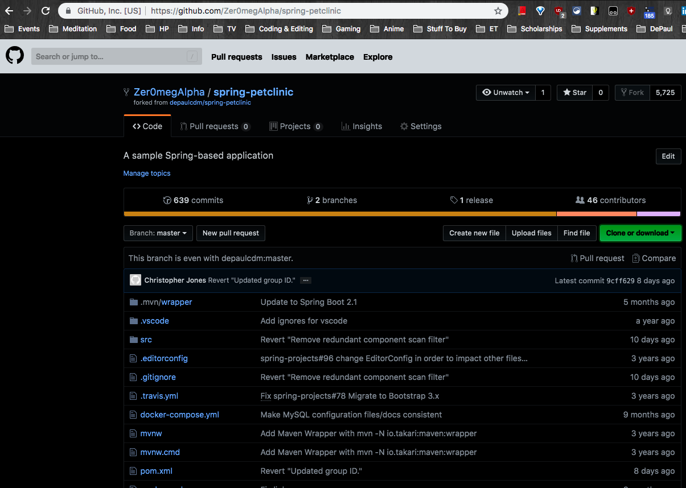
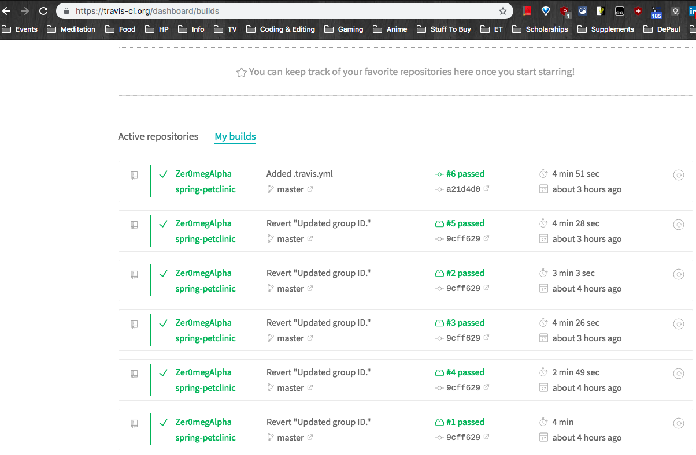
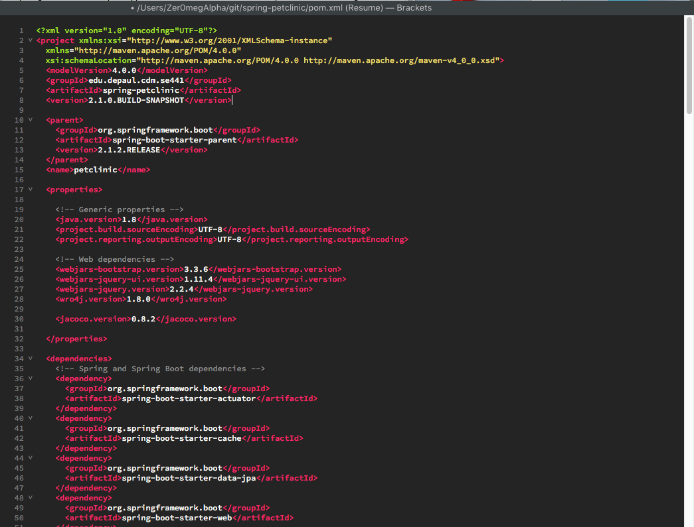
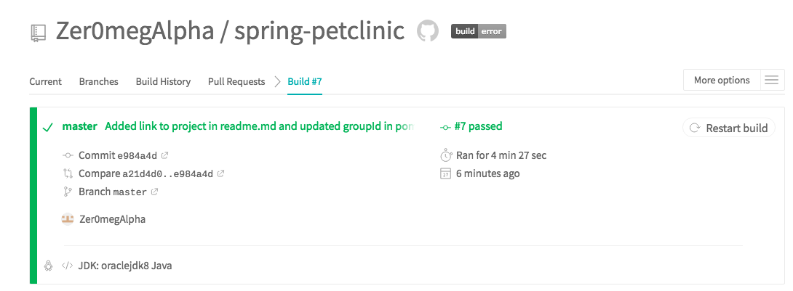
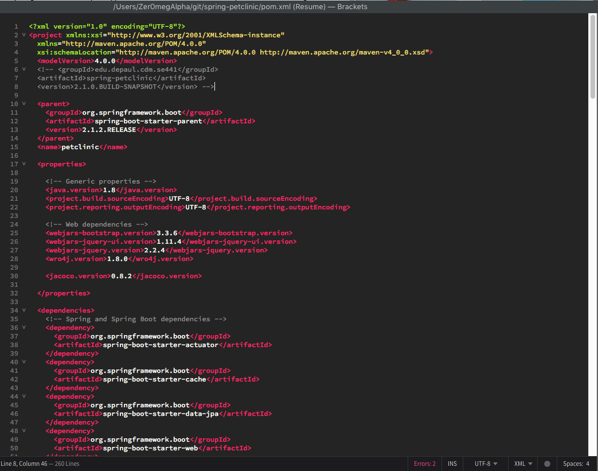
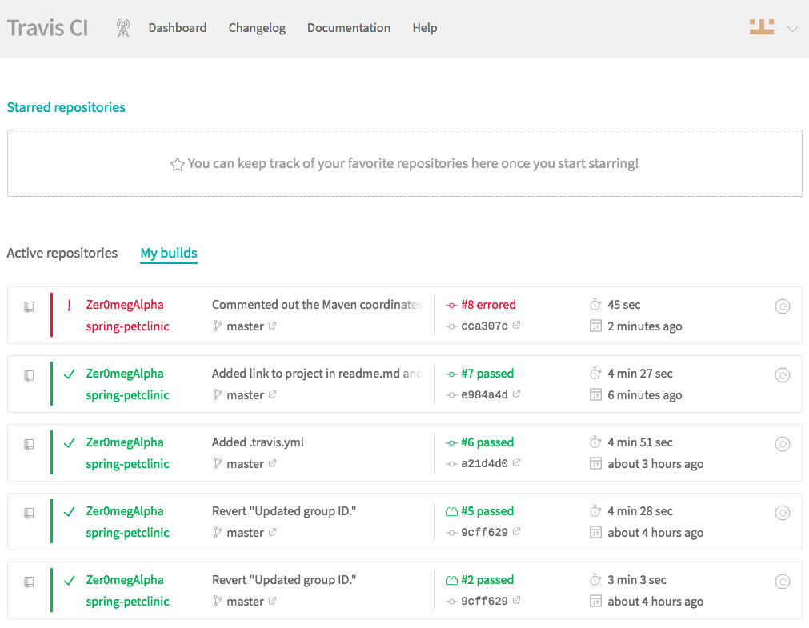
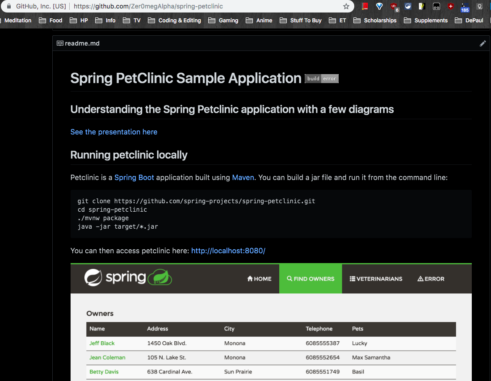
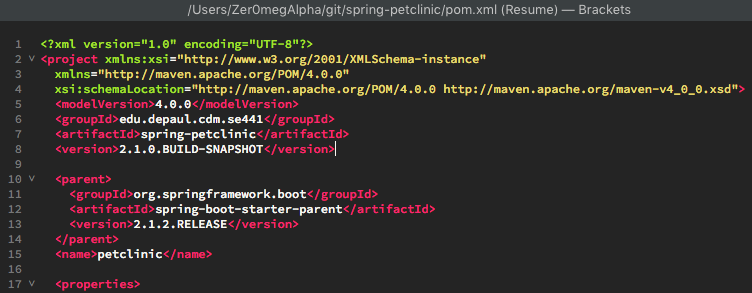
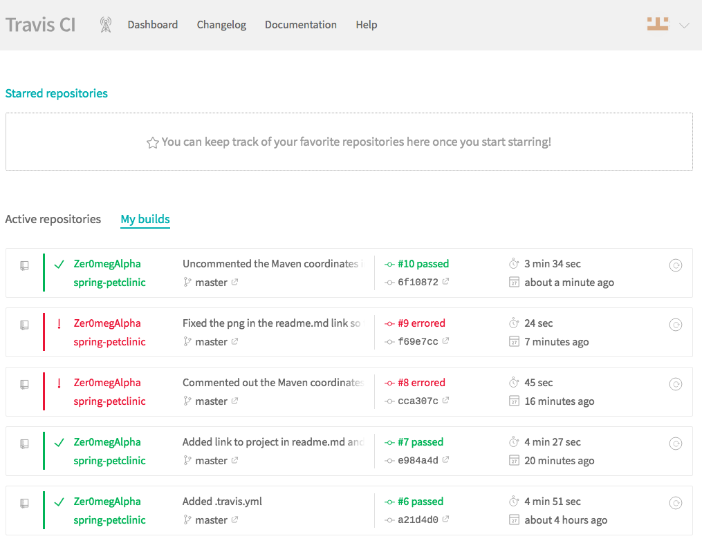
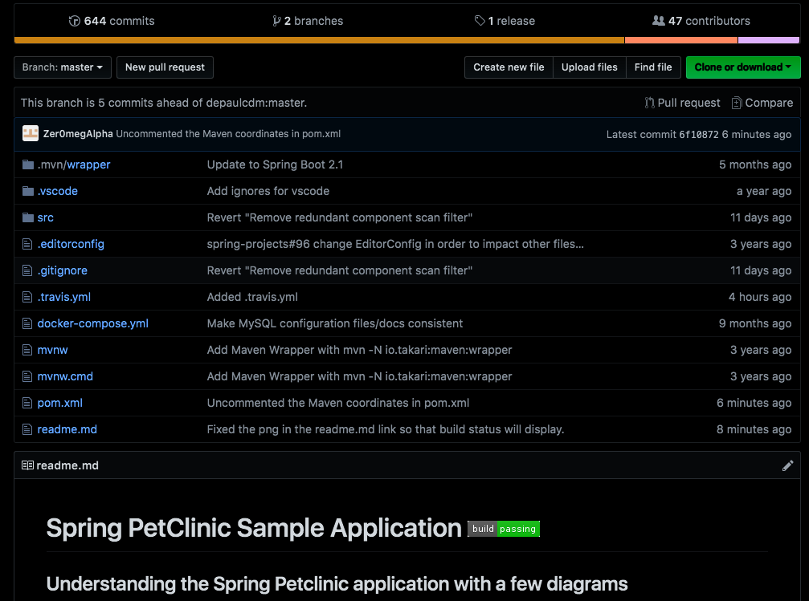

5 pts Your Github account showing that is has been forked from the depaulcdm/springpetclinic repository.DONE

5 pts Your Travis CI dashboard showing a successful first build.DONE

5 pts The section of the POM file showing the coordinates after you’ve changed them.DONE

5 pts Your Travis CI dashboard showing a successful build after your change of the groupID.DONE

5 pts The section of the POM file showing the coordinates after you’ve commented them out.DONE

5 pts Your Travis CI dashboard showing the unsuccessful build after the breaking change.DONE

5 pts Your Github repository with the readme.md file selected showing the build failed status after the Travis CI build fails.DONE

5 pts The section of the POM file showing the coordinates after you’ve fixed them.DONE

5 pts Your Travis CI dashboard showing the successful build after the breaking change has been fixed.DONE

5 pts Your Github repository with the readme.md file selected showing the build success status after the Travis CI build has recovered.DONE
